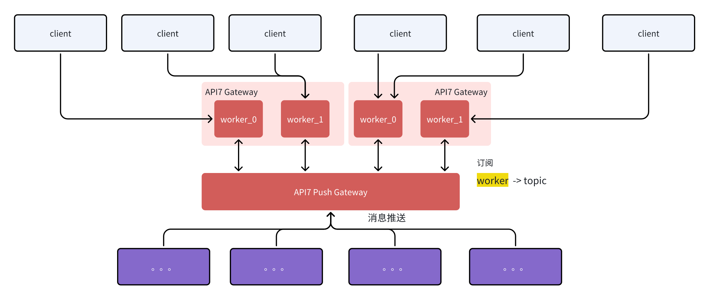

## 描述

`ht-ws-msg-pub` 插件通过 Websocket 协议，与 API7 Push Gateway 组件配合，实现消息订阅和推送。



其中，消息的订阅同时支持 Websocket 和 HTTP 接口，因此 Websocket 帧的数据结构我们尽量与 HTTP 请求保持一致。

消息的推送，支持通过 Topic 给订阅了该 Topic 的连接推送消息，也支持通过特殊 Topic 给指定连接推送消息。


## 属性

不需要配置


## Metadata

| 名称           | 类型    | 必选项   | 默认值  | 有效值                                   | 描述                                                                                                                                                                                                                                 |
| ------------- | ------- | ------- | ------ | --------------------------------------- | ----------------------------------------------------------------------------------------------- |
| api7_push_gateway_addrs        | array | 是       |      |   | API7 Push Gateway 节点地址 |


## 启用插件

以下示例展示了如何在指定路由上启用 `ht-ws-msg-pub` 插件，并设置子路由（配合  [ht-ws-msg-sub 插件](./ht-ws-msg-sub.md)）来处理不同的请求：

通过 metadata 设置 API7 Push Gateway 节点地址：

```shell
curl -i http://127.0.0.1:9180//apisix/admin/plugin_metadata/ht-ws-msg-pub \
-H 'X-API-KEY: edd1c9f034335f136f87ad84b625c8f1' -X PUT -d '
{
    "api7_push_gateway_addrs": [
        "ws://api7-push-gateway1:9110/websocket",
        "ws://api7-push-gateway2:9110/websocket"
    ]
}'
```

配置路由并启用 `ht-ws-msg-pub` 插件：

```shell
curl -i http://127.0.0.1:9180/apisix/admin/routes/1 \
-H 'X-API-KEY: edd1c9f034335f136f87ad84b625c8f1' -X PUT -d '
{
    "uri": "/msg-pub",
    "plugins": {
        "ht-ws-msg-pub": {}
    }
}'
```


设置子路由，用于处理具体逻辑：

握手：
```shell
curl -i http://127.0.0.1:9180/apisix/admin/routes/11 \
-H 'X-API-KEY: edd1c9f034335f136f87ad84b625c8f1' -X PUT -d '
{
    "plugins": {
        "ht-msg-sub": {
            "action": "register",
            "upstream": {
                "nodes": [{
                    "host": "mock-ms1975",
                    "port": 1975,
                    "weight": 1
                }],
                "type": "roundrobin"
            }
        }
    },
    "labels": {
        "superior_id": "1"
    },
    "uri": "/60101/ormp/session/channelRegister"
}'
```

增量订阅：

```shell
curl -i http://127.0.0.1:9180/apisix/admin/routes/12 \
-H 'X-API-KEY: edd1c9f034335f136f87ad84b625c8f1' -X PUT -d '
{
    "plugins": {
        "ht-msg-sub": {
            "action": "sub_add",
            "upstream": {
                "nodes": [{
                    "host": "mock-ms1975",
                    "port": 1975,
                    "weight": 1
                }],
                "type": "roundrobin"
            }
        }
    },
    "labels": {
        "superior_id": "1"
    },
    "uri": "/60150/ormp/subscribe/accountSubscribe"
}'
```

全量订阅：

```shell
curl -i http://127.0.0.1:9180/apisix/admin/routes/13 \
-H 'X-API-KEY: edd1c9f034335f136f87ad84b625c8f1' -X PUT -d '
{
    "plugins": {
        "ht-msg-sub": {
            "action": "sub_put",
            "nodes": [{
                "host": "mock-ms1975",
                "port": 1975,
                "weight": 1
            }],
            "type": "roundrobin"
        }
    },
    "labels": {
        "superior_id": "1"
    },
    "uri": "/60150/ormp/subscribe/syncSubscribe"
}'
```

取消订阅：

```shell
curl -i http://127.0.0.1:9180/apisix/admin/routes/14 \
-H 'X-API-KEY: edd1c9f034335f136f87ad84b625c8f1' -X PUT -d '
{
    "plugins": {
        "ht-msg-sub": {
            "action": "sub_delete",
            "nodes": [{
                "host": "mock-ms1975",
                "port": 1975,
                "weight": 1
            }],
            "type": "roundrobin"
        }
    },
    "labels": {
        "superior_id": "1"
    },
    "uri": "/60150/ormp/subscribe/cancelSubscribe"
}'
```

断开连接：

```shell
curl -i http://127.0.0.1:9180/apisix/admin/routes/15 \
-H 'X-API-KEY: edd1c9f034335f136f87ad84b625c8f1' -X PUT -d '
{
    "plugins": {
        "ht-msg-sub": {
            "action": "disconnect",
            "nodes": [{
                "host": "mock-ms1975",
                "port": 1975,
                "weight": 1
            }],
            "type": "roundrobin"
        }
    },
    "labels": {
        "superior_id": "1"
    },
    "uri": "/60101/ormp/session/channelDisconnect"
}'
```

## 使用示例

### 一、创建 Websocket 连接

可以通过以下地址与 API7 Gateway 创建 Websocket 连接:

```
ws://127.0.0.1:9080/msg-pub
```


### 二、握手

通过第一步中创建的连接发送请求，进行握手操作（连接注册）：

```json
{
    "uri":"/60101/ormp/session/channelRegister",
    "header": {
        "ts": 132132132,
        "msgId": "1",
        "Content-Type": "json",
        "client-metadata": {}
    },
    "body":{}
}
```


### 三、增量订阅

通过第一步中创建的连接发送请求，进行增量订阅：

```json
{
    "uri":"/60150/ormp/subscribe/accountSubscribe",
    "header": {
        "ts": 132132132,
        "msgId": "2",
        "Content-Type": "json",
        "client-metadata": {}
    },
    "body":{
          "topics":["hq_100001_129", "hq_100001_123"]
    }
}
```

### 四、全量同步订阅的所有 topic

通过第一步中创建的连接发送请求，进行全量订阅同步：

```json
{
    "uri":"/60150/ormp/subscribe/syncSubscribe",
    "header": {
        "ts": 132132132,
        "msgId": "3",
        "Content-Type": "json",
        "client-metadata": {}
    },
    "body":{
          "topics":["hq_100001_129", "hq_100001_123", "hq_100001_131", "hq_100001_133"]
    }
}
```

### 五、取消订阅

通过第一步中创建的连接发送请求，进行全量订阅同步：

```json
{
    "uri":"/60150/ormp/subscribe/cancelSubscribe",
    "header": {
        "ts": 132132132,
        "msgId": "4",
        "Content-Type": "json",
        "client-metadata": {}
    },
    "body":{
          "topics":["hq_100001_129"]
    }
}
```

### 六、断开连接

通过第一步中创建的连接发送请求，通知服务端断开连接：

```json
{
    "uri":"/60101/ormp/session/channelDisconnect",
    "header": {
        "ts": 132132132,
        "msgId": "4",
        "Content-Type": "json",
        "client-metadata": {}
    }
}
```
